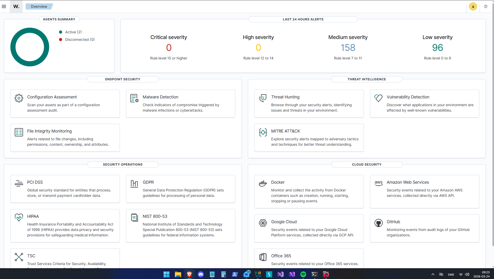
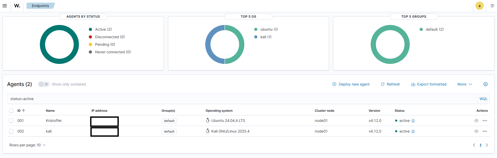
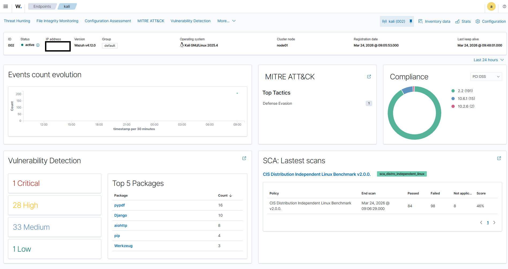

# Wazuh SIEM Lab – Säkerhetsövervakning & Hotdetektion

Ett hands on labbprojekt där Wazuh används som SIEM-plattform för att övervaka
två agenter, detektera sårbarheter, granska systemkonfigurationer mot CIS Benchmark
och simulera attacker med realtidsdetektion via MITRE ATT&CK.


## Miljö

| Komponent | Detaljer |
|-----------|----------|
| SIEM-plattform | Wazuh v4.12.0 |
| Cluster node | node01 - Darkwatch-manager(single node) |
| Agent 001 – Kristoffer | Ubuntu 24.04.4 LTS – IP: NAT/Host-only |
| Agent 002 – kali | Kali GNU/Linux 2025.4 – IP: NAT/Host-only |


## Utmaningar & lösningar

| Problem | Lösning |
|---------|---------|
| Agent v4.14.4 inkompatibel med manager v4.12.0 | Installerade matchande agentversion |
| Config återställdes vid ominstallation | Satte manager-IP manuellt i ossec.conf |
| Krasch under installation | Verifierade tjänststatus via dpkg och systemctl |

---


## 1. Översikt – Wazuh Dashboard

Wazuh-miljön består av två aktiva agenter utan disconnections.
Senaste 24 timmarnas alerts visade 0 kritiska, 158 Medium och 96 Low severity events.






## 2. Agent 002 – Kali GNU/Linux

### Agent Overview

Kali-agenten är aktiv och registrerad sedan 24 mars 2026.
SCA-scan kördes mot CIS Distribution Independent Linux Benchmark v2.0.0.



**SCA-resultat – CIS Distribution Independent Linux Benchmark v2.0.0:**
| Status | Antal |
|--------|-------|
| Passed | 84 |
| Failed | 98 |
| Not applicable | 8 |
| Score | 46% |

**Vulnerability Detection:**
| Allvarlighetsgrad | Antal |
|-------------------|-------|
| Critical | 1 |
| High | 28 |
| Medium | 33 |
| Low | 1 |

**Top 5 sårbara paket:** pypdf (16), Django (10), aiohttp (8), pip (4), Werkzeug (3)


### Baseline – Threat Hunting (före attack)

Normalläge innan attacksimulering:
- Total events (24h): 206
- Level 12+ alerts: 0
- Authentication failures: 0
- Dominerande regelgrupper: sca, ossec, rootcheck


### Kritisk Sårbarhet – CVE-2025-43859

Wazuh identifierade en kritisk sårbarhet i paketet **h11**.
CVE-2025-43859 har ett CVSS-score på 9.1 och publicerades 2025.


### Attacksimulering – SSH Brute Force med Hydra

En SSH brute force-attack simulerades från Kali mot sig själv
för att testa Wazuhs detektionsförmåga i realtid.

```bash
hydra -l kali -P /usr/share/wordlists/rockyou.txt -t 4 ssh://NAT/Host-only
